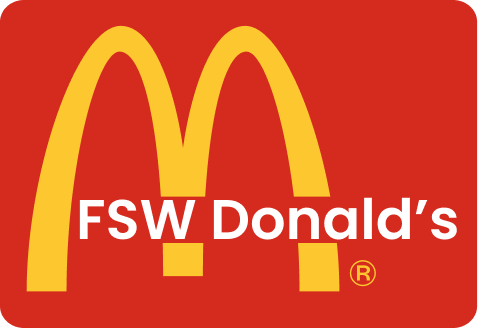
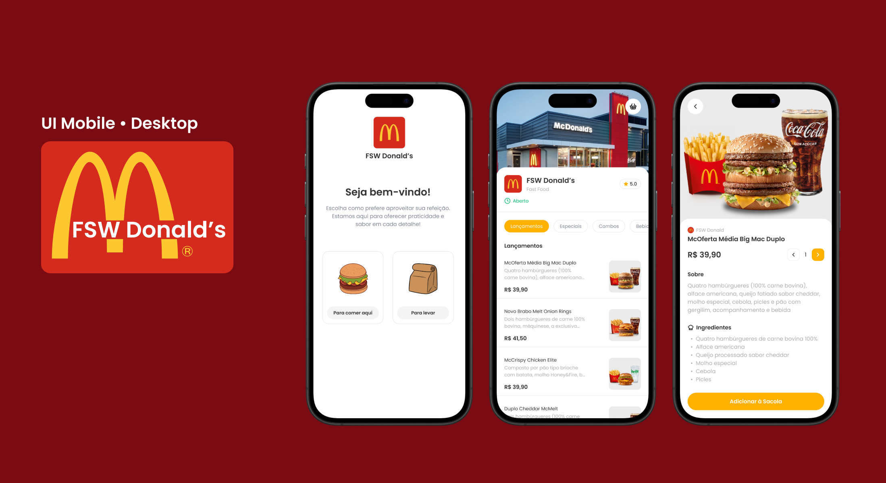

<h1 align="center">
  
</h1>

 

  

## ✨ Tecnologias

Esse projeto foi desenvolvido com as seguintes tecnologias:

## 💻 Projeto

O FSW Donald's é um Self Checkout de autoatendimento para restaurantes
